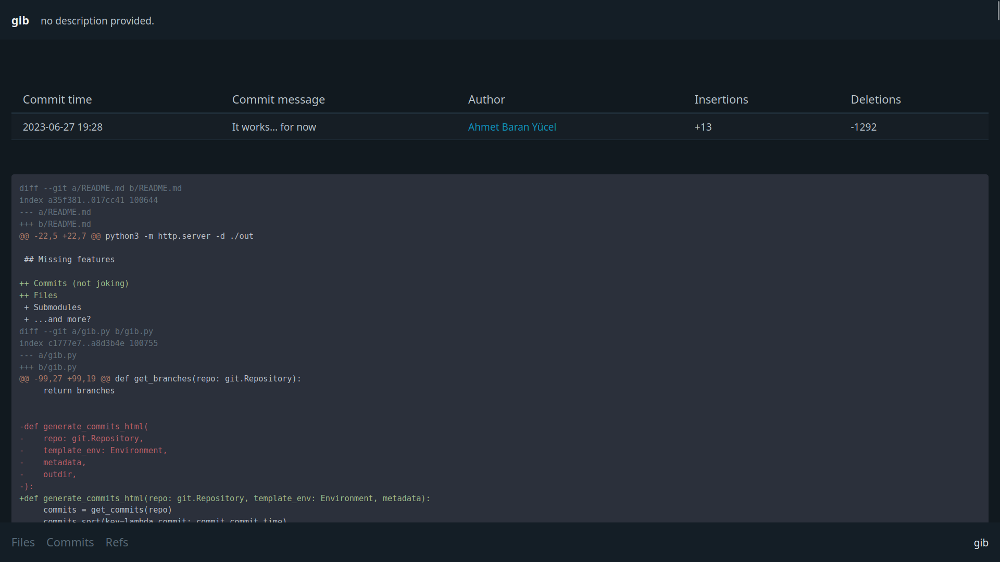

# gib

> dumb git repository static site generator

This project is incomplete, and in a broken state.
I'm working on this to learn the internals of Git, so I'll probably drop it after a while.

## Usage example

```sh
# clone this repository and enter its directory
git clone https://github.com/abyucel/gib && cd ./gib
# install the requirements
python3 -m pip install -r ./requirements.txt
# generate the static files
python3 ./gib.py . ./out
# create a symlink pointing to ./public in ./out (or just copy the folder)
ln -sf ../public ./out/public
# run your http server
python3 -m http.server -d ./out
```

## Missing features

+ Submodules
+ ...and more?

## Screenshots



